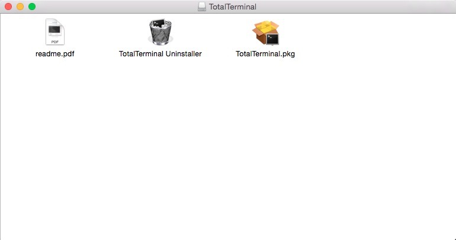
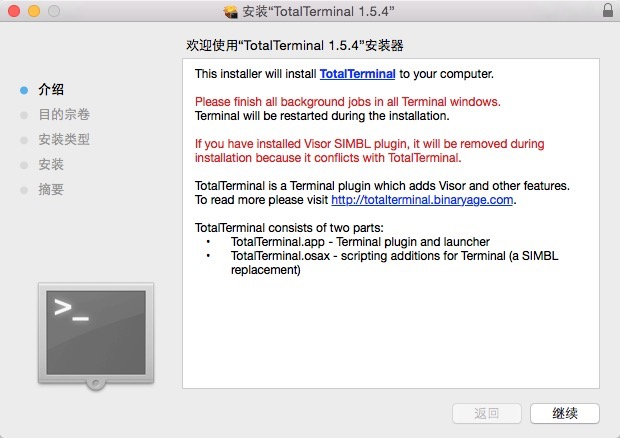
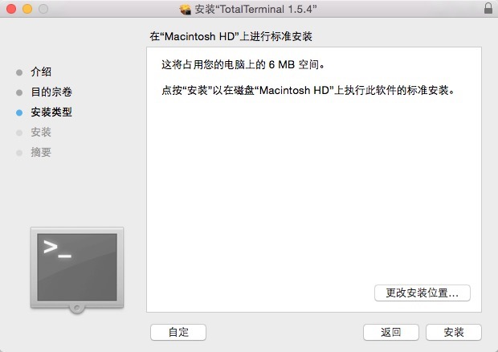
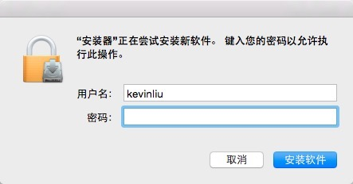
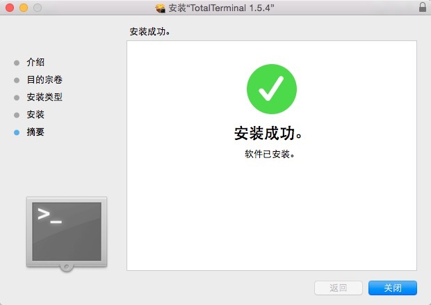
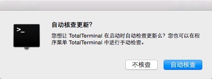
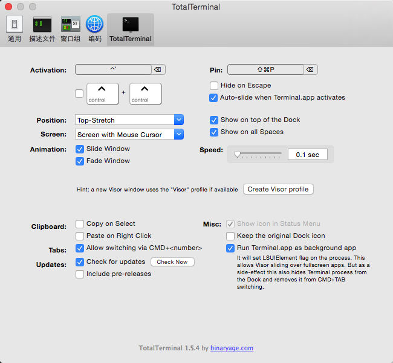

# TotalTerminal安装及配置

## 安装

* 下载 `http://downloads-2.binaryage.com/TotalTerminal-1.5.4.dmg`
* 安装过程
	
	选择pkg文件进行安装
	
	
	
	点击继续
	
	
	
	点击安装
	
	
	
	输入密码
	
	
	
	安装完成
	
	
	
	设置自动更新
	
	

## 配置

1. `CMD + ,` 进入设置界面
2. 通用标签下 修改文件新建窗口为Homebrew(这个仅仅是个人爱好问题)
3. 描述文件标签下 将Homebrew设置为默认
4. 对文本的字体及光标等样式进行个性化设置
5. shell小标签下 设置当shell退出时 关闭窗口
6. TotalTerminal标签下 点选 如下配置

## 快捷键

1. `Control + ~` 唤醒命令行

### [回导航页](../README.md)