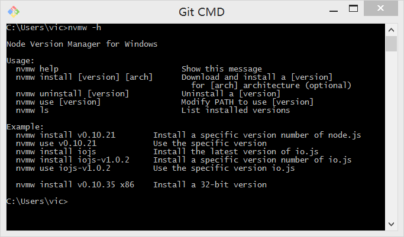

# nvm(node version manager - node版本管理工具)

通过该工具可以在同一台计算机上安装node的多个版本，并可以方便地在不同版本切换，可单独安装，也可通过npm安装，这里以单独安装为例。

## Mac

* 安装nvm

    ```
    curl -o- https://raw.githubusercontent.com/creationix/nvm/v0.33.2/install.sh | bash
    ```
* 添加全局命令，在 `~/.zshrc`中，添加 `source ~/.nvm/nvm.sh`

    ```
    vi ~/.zshrc
    ```
* 安装node

    ```
    nvm install v4.8.4
    nvm install v0.12.7
    ```
* 测试node是否安装成功

    ```
    node -v
    ```
* 设置nvm默认node版本

    ```
    nvm alias default 4.8.4
    nvm alias stable default
    ```
* 查看node安装路径

    ```
    which node
    ```

## Windows

windows中可以通过安装nvmw或者nvm for Windows来完成同样的功能。

### nvmw
* 安装[git for windows](https://github.com/git-for-windows/git/releases/tag/v2.5.3.windows.1)，如果想在cmd中也使用git命令，请在如下图所示的安装选择中选择第二个：
		
* 其中的git bash不只为git提供了命令行工具，也提供了*nix系统里shell脚本所包含的命令，如ls，rm等。
	
* 获取环境变量"%HOMEDRIVE%和%HOMEPATH%，cmd中 执行`set`：
	
* 安装nvmw，cmd执行：
	`git clone git://github.com/hakobera/nvmw.git "%HOMEDRIVE%%HOMEPATH%\.nvmw"`
	
* 配置Path环境变量，使nvmw成为全局命令，试过github上说的通过命令行来添加Path环境变量，但是cmd窗口关闭后，就失效，改而通过控制面板设置：
	
	
* 查看相关命令 `nvmw -h`

	
* 通过以上方法安装的nvmw无法在git bash中使用，无论是在~/.bashrc中添加source还是在Path中添加环境变量，暂时没有找到方法解决。
* node/io/npm源指向问题请参考相关[README](https://github.com/hakobera/nvmw#mirror-nodejsiojsnpm-dist)

### nvm for Windows
* nvm for Windows提供了[安装程序](https://github.com/coreybutler/nvm-windows/releases)，可以直接安装，省去配置环境变量的麻烦步骤
* 安装成功后，在cmd中执行`nvm install 0.12.7`和`nvm use 0.12.7`来安装node
* 以上命令在git bash中执行无效，但是cmd安装好node后，就可以在git bash中使用node/npm相关命令了

### [回导航页](../README.md)
